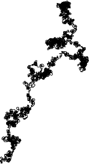
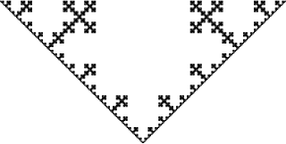

## L-systems

My goal is to implement all features of the L-system described in 'Algorithmic
Beauty of Plants' (ABOP). The input will be from files using the grammar
described in ABOP. The result will be either an SVG (for 2D models) or
something else for 3D (I haven't settled on a format yet, but should be
something that can be read by Blender).

## Examples

### DOL-systems

The data structures I used to represent the L-systems are very general. They
allow stochastic, context-sensitive, parametric L-systems (the algorithms and
graphics for these higher forms aren't implemented yet). But expressing systems in this general format is extremely verbose, so I wrote the special handler `transDolSys`.

As I implement the higher features, I will probably add similar convenience
functions. Ultimately, I would like to have a full parser for the L-system
grammar used in ABOP.

``` haskell
import Lsystem

render' :: String -> System -> IO ()
render' = renderSystem (400,400)

main :: IO ()
main = do
  render' "s1.svg" $ transDolSys 3 90 "F-F-F-F" "F-F+F-F+F"                      
  render' "s2.svg" $ transDolSys 2 90 "F-F-F-F" "F+FF-FF-F-F+F+FF-F-F+F+FF+FF-F" 
  render' "s3.svg" $ transDolSys 3 90 "F-F-F-F" "FF-F--F-F"                      
  render' "s4.svg" $ transDolSys 3 90 "F-F-F-F" "F-F-F+F+F-F-F+F+F"              
  render' "s5.svg" $ transDolSys 2 90 "F-F-F-F" "FF+F+F-FFF-FFF-FFF-F+F+FF"      
  render' "s6.svg" $ transDolSys 3 90 "F-F-F-F" "F+F+F-F-F+F-F-F+F-F-F+F+F"      
  render' "s7.svg" $ transDolSys 4 90 "F-F-F-F" "FF-F+F+F-F"                     
  render' "s8.svg" $ transDolSys 4 90 "F-F-F-F" "FF-F-F+F+F-F+F+F-F+F+F-F-FF"    
  render' "s9.svg" $ transDolSys 5 90 "F"       "F+F-F-F+F"                      
```





