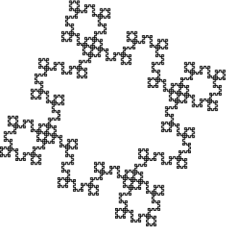

## L-systems

My goal is to implement all features of the L-system described in 'Algorithmic
Beauty of Plants' (ABOP). The input will be from files using the grammar
described in ABOP. The result will be either an SVG (for 2D models) or
something else for 3D (I haven't settled on a format yet, but should be
something that can be read by Blender).

## Examples

### DOL-systems

The data structures I used to represent the L-systems are very general. They
allow stochastic, context-sensitive, parametric L-systems (the algorithms and
graphics for these higher forms aren't implemented yet). But expressing systems
in this general format is extremely verbose, so I wrote the special handler
`transDolSys`.

As I implement the higher features, I will probably add similar convenience
functions. Ultimately, I would like to have a full parser for the L-system
grammar used in ABOP.

``` haskell
import Lsystem
import System.Random

render' :: String -> System -> IO ()
render' = renderSystem (mkStdGen 42) (400,400)

main :: IO ()
main = do
  render' "d1.svg" $ transDolSys 3 90 "F-F-F-F" "F-F+F-F+F"
  render' "d2.svg" $ transDolSys 2 90 "F-F-F-F" "F+FF-FF-F-F+F+FF-F-F+F+FF+FF-F"
  render' "d3.svg" $ transDolSys 3 90 "F-F-F-F" "FF-F--F-F"
  render' "d4.svg" $ transDolSys 3 90 "F-F-F-F" "F-F-F+F+F-F-F+F+F"
  render' "d5.svg" $ transDolSys 2 90 "F-F-F-F" "FF+F+F-FFF-FFF-FFF-F+F+FF"
  render' "d6.svg" $ transDolSys 3 90 "F-F-F-F" "F+F+F-F-F+F-F-F+F-F-F+F+F"
  render' "d7.svg" $ transDolSys 4 90 "F-F-F-F" "FF-F+F+F-F"
  render' "d8.svg" $ transDolSys 4 90 "F-F-F-F" "FF-F-F+F+F-F+F+F-F+F+F-F-FF"
  render' "d9.svg" $ transDolSys 5 90 "F"       "F+F-F-F+F"
```





### Stochastic systems

L-systems can be made stochastic be adding probabilistic rules. A probabilistic
rule is a set of rules associated with probabilities, where the probabilities
must some to a number less than or equal to 1 (with the implicit default rule
of N -> N making up the difference).


``` haskell
import Lsystem
import System.Random

render' :: String -> System -> IO ()
render' = renderSystem (mkStdGen 42) (400,400)

s1 = transSolSys 12 45 "F" [(0.4, "FF"), (0.5, "-F"), (0.1, "FF-FF-FF-FF")]

main :: IO ()
main = do
  render' "s1.svg" s1
```


### Branching

I currently don't have any sugar for branching. So I will do this the hard way.

``` haskell
import Lsystem
import System.Random

render' :: String -> System -> IO ()
render' = renderSystem (mkStdGen 42) (400,400)

isF :: Node -> Bool
isF (NodeDraw _ _) = True
isF _ = False

-- -- This example is taken from ABOP pp. 25
-- n=5 d=25.7
-- F -> F[+F]F[-F]F

b1 = System {
      systemBasis = [NodeRotate [] (90) 0 0, NodeDraw [] 1] -- F
    , systemRules = [               -- F[+F]F[-F]F
        DeterministicRule {
            ruleContext = ignoreContext
          , ruleCondition = unconditional
          , ruleMatch = isF
          , ruleReplacement = [
                NodeDraw [] 1 ------------------ F
              , NodeBranch [[ ------------------ [+F]
                    NodeRotate [] (-25.7) 0 0
                  , NodeDraw [] 1
                ]]
              , NodeDraw [] 1 ------------------ F
              , NodeBranch [[ ------------------ [-F]
                    NodeRotate [] 25.7 0 0
                  , NodeDraw [] 1
                ]]
              , NodeDraw [] 1 ------------------ F
            ]
        }
      ]
    , systemSteps = 5
  }

main :: IO ()
main = do
  render' "b1.svg" b1
```


## TODO

 - [x] deterministic
 - [x] stochastic
 - [x] branching
 - [ ] parametric
 - [ ] context sensitive
 - [x] stochastic sugar
 - [x] deterministic sugar
 - [ ] branching sugar
 - [ ] parametric sugar
 - [ ] context sensitive sugar
 - [x] 2D visualization
 - [ ] 3D handling
 - [ ] 3D visualization
 - [ ] animation
 - [ ] polygons
 - [ ] colors and such
 - [ ] ABOP language parsing
